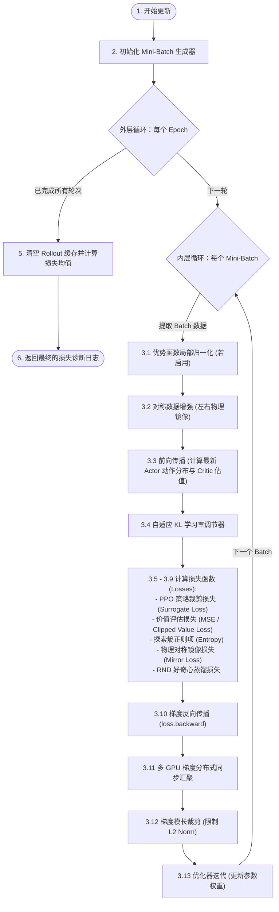

# PPO 算法与更新优化深度指南 (流程 + 数学公式)

本指南将悟空机器人项目 `rsl_rl` 代码库中 `ppo.py` 与 `rollout_storage.py` 的**物理架构流程**与**底层数学公式**完美融合，以便于随时对照推演与开发查阅。

---

## 一、 PPO 核心工作流与架构设计

在每次强化学习迭代中，`update()` 函数在多个 Epoch 和 Mini-Batch 维度上展开，在 GPU 上完成参数优化。

### 核心阶段详解：

1. **准备与初始化**：通过 GAE 算法将全局 trajectory 折现并回溯计算好优势函数。然后通过 `mini_batch_generator` 将数据展平、随机打乱。
2. **Epoch 与 Mini-Batch 嵌套循环**：
   * **为什么可以做多个 Epoch**：利用**重要性采样**修正新旧策略的分布偏差；并借助 **Clip 裁剪**与**自适应 KL 散度控制**将新旧策略距离限制在邻域内，确保重要性采样的高效与低方差。
   * **每个 Epoch 的 Mini-Batch 划分**：在 `ppo.update()` 开始时进行一次性随机打乱固化，在 5 个 Epoch 内循环复用同一套 Mini-Batch 划分（包 A->B->C->D），从而最大化 GPU 的重排与计算效率。

---

## 二、 PPO 精确数学公式定义

下面是代码库中各模块前向计算与反向传播的精确数学公式：

### 1. 策略动作概率比值 (Probability Ratio)

代码中采用对数空间的减法来替代除法以保证数值安全，再取指数还原，公式为：

$$r_t(\theta) = \frac{\pi_\theta(a_t|s_t)}{\pi_{\theta_{\text{old}}}(a_t|s_t)} = \exp\Big(\ln\pi_\theta(a_t|s_t) - \ln\pi_{\theta_{\text{old}}}(a_t|s_t)\Big)$$

---

### 2. 策略更新损失 (Policy Surrogate Loss)

为了利用 PyTorch 优化器进行最小化梯度下降，代码对策略损失前加了负号。运用数学变换 $-\min(x, y) = \max(-x, -y)$，代码实现为：

$$\mathcal{L}_{\text{surr}}(\theta) = \hat{\mathbb{E}}_t \left[ \max\left( -r_t(\theta)\hat{A}_t, \, -\text{clip}(r_t(\theta), 1-\epsilon, 1+\epsilon)\hat{A}_t \right) \right]$$

*   $\hat{A}_t$ 是估计优势值（Advantages）。
*   $\epsilon$ 是策略裁剪阈值（对应配置中的 `clip_param = 0.2`）。

---

### 3. 价值评估损失 (Value Function Loss)

当启用限制更新幅度的 Clipped 价值损失（`use_clipped_value_loss = True`）时，其公式定义如下：

#### 1) 裁剪后的价值预测值：
$$V_{\phi}^{\text{clip}}(s_t) = V_{\phi_{\text{old}}}(s_t) + \text{clip}\Big( V_\phi(s_t) - V_{\phi_{\text{old}}}(s_t), \, -\epsilon, \, \epsilon \Big)$$
*   $V_\phi(s_t)$ 是当前最新 Critic 的预测值（代码中为 `value_batch`）。
*   $V_{\phi_{\text{old}}}(s_t)$ 是交互时旧 Critic 预测的估计值（代码中为 `target_values_batch`）。

#### 2) 价值均方误差损失：
$$\mathcal{L}_{\text{value}}(\phi) = \hat{\mathbb{E}}_t \left[ \max\left( \big(V_\phi(s_t) - R_t\big)^2, \, \big(V_{\phi}^{\text{clip}}(s_t) - R_t\big)^2 \right) \right]$$
*   $R_t$ 是实际折扣回报（代码中为 `returns_batch`）。
*   若未启用 Clipper，则直接退化为常规的 MSE 损失：$\mathcal{L}_{\text{value}}(\phi) = \hat{\mathbb{E}}_t \left[ (V_\phi(s_t) - R_t)^2 \right]$。

---

### 4. 探索度熵正则化项 (Entropy Regularizer)

为了延缓策略收敛，引入了高斯分布熵正则项：

$$\mathcal{L}_{\text{entropy}}(\theta) = -\hat{\mathbb{E}}_t \left[ \mathcal{H}\big(\pi_\theta(\cdot|s_t)\big) \right]$$

对于 $D$ 维独立高斯分布，动作熵 $\mathcal{H}$ 的解析展开式为：

$$\mathcal{H}\big(\pi_\theta(\cdot|s_t)\big) = \frac{1}{2} \sum_{j=1}^{D} \Big( 1 + \ln(2\pi\sigma_j^2) \Big)$$

---

### 5. 对称镜像辅助损失 (Symmetry/Mirror Loss)

如果不进行直接数据增强，代码也可以在 Loss 端增加对称约束项：

$$\mathcal{L}_{\text{mirror}}(\theta) = \hat{\mathbb{E}}_t \left[ \text{MSE}\Big( \mu_\theta(\text{sym}(s_t)), \, \text{sym}\big(\mu_\theta(s_t)\big)_{\text{detached}} \Big) \right]$$

*   $\mu_\theta(s)$ 为动作的确定性均值，$\text{sym}(\cdot)$ 代表物理镜像变换。
*   `detached` 限制了梯度只能通过左侧路径反向传播，极大地稳定了训练的收敛曲线。

---

### 6. 好奇心蒸馏损失 (RND Loss)

若启用了好奇心模块，其 Predictor 网络的损失公式为：

$$\mathcal{L}_{\text{RND}}(\psi) = \hat{\mathbb{E}}_t \left[ \Big\| f_{\text{pred}}(s_t; \big\|_2^2 \right]$$
*   等式有笔误，修正为：
$$\mathcal{L}_{\text{RND}}(\psi) = \hat{\mathbb{E}}_t \left[ \Big\| f_{\text{pred}}(s_t; \psi) - f_{\text{target}}(s_t)_{\text{detached}} \Big\|_2^2 \right]$$

---

### 7. 整体联合优化损失 (Total Loss)

在代码中，多任务优化的总 Loss 定义为：

$$\mathcal{L}_{\text{total}} = \mathcal{L}_{\text{surr}}(\theta) + c_1 \mathcal{L}_{\text{value}}(\phi) + c_2 \mathcal{L}_{\text{entropy}}(\theta) + c_m \mathcal{L}_{\text{mirror}}(\theta)$$

其中：
*   $c_1$ = `value_loss_coef` (对应配置为 `1.0`)
*   $c_2$ = `-entropy_coef` (对应配置为 `-0.005`)
*   $c_m$ = `mirror_loss_coeff` (若启用)

---

## 三、 附：优势函数与折扣回报的计算公式 (GAE)

在 `rollout_storage.py` 中，计算 $\hat{A}_t$ 与 $R_t$ 时，公式为自后向前（从第 $T-1$ 步向第 0 步反向迭代递推）：

#### 1) 单步 TD 误差（Temporal Difference Error）：
$$\delta_t = r_t + \gamma V_{\phi_{\text{old}}}(s_{t+1}) (1 - d_t) - V_{\phi_{\text{old}}}(s_t)$$

#### 2) GAE 优势估计值：
$$\hat{A}_t = \delta_t + (\gamma \lambda) (1 - d_t) \hat{A}_{t+1}$$

#### 3) 折扣回报目标值（作为 Critic 拟合的标签）：
$$R_t = \hat{A}_t + V_{\phi_{\text{old}}}(s_t)$$

*   $\gamma$ 是折扣率（配置值为 `0.99`）。
*   $\lambda$ 是 GAE 参数（配置值为 `0.95`）。
*   $d_t \in \{0, 1\}$ 是死亡标志（对应 `dones`，若发生重置则为 1，切断未来价值自举，否则为 0）。
