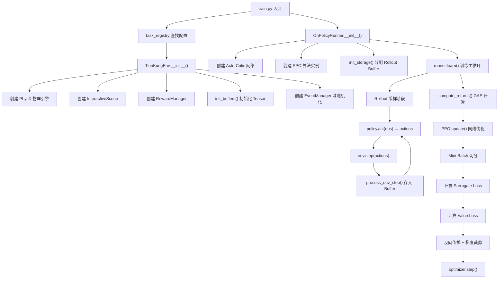
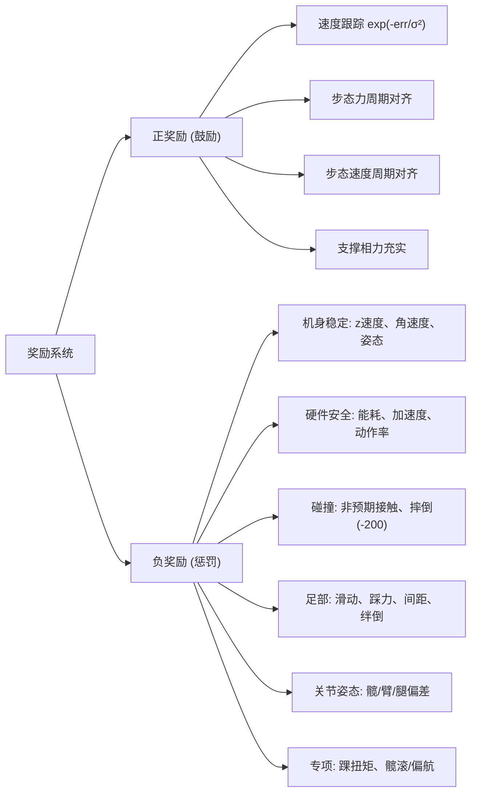
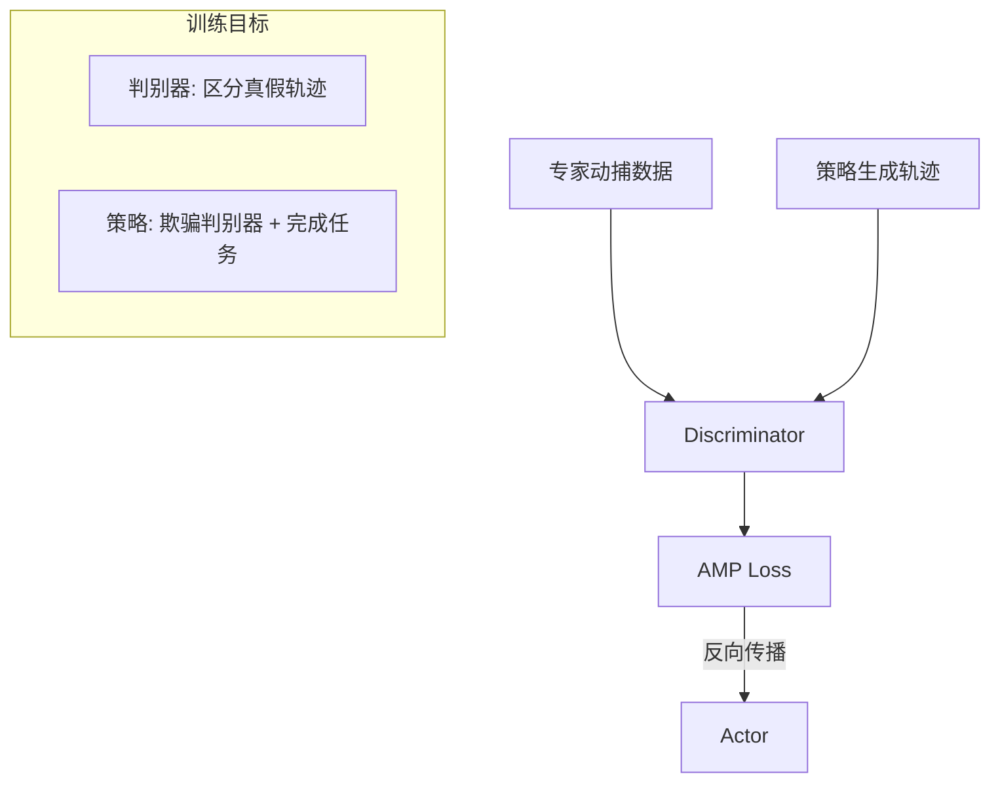
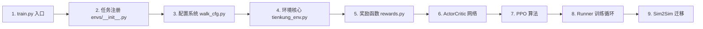

# TienKung-Lab 代码仓库完整学习指南

> [!NOTE]
> 本文档基于你当前打开的所有文件，系统性地梳理了整个代码库的架构、执行流程和核心算法。

---

## 1. 项目概述

TienKung-Lab 是一个**基于强化学习的全尺寸人形机器人运动控制系统**，为 TienKung（天宫）人形机器人设计。

**核心特点：**
- 基于 **IsaacLab 2.1.0** 构建仿真环境（GPU 并行 4096 个机器人同时训练）
- 采用 **PPO + AMP（对抗运动先验）** 双模式训练
- 支持 **周期性步态奖励**（Gait Clock）驱动自然行走/跑步
- 支持 **Sim2Sim** 到 MuJoCo 的迁移验证
- 已在真实 TienKung 机器人上成功部署

---

## 2. 目录结构总览

```
TienKung-Lab/
├── legged_lab/                    # 主项目：环境、奖励、脚本
│   ├── envs/                      # 环境定义
│   │   ├── base/                  # 基础环境类（通用四足/双足）
│   │   │   ├── base_env.py        # BaseEnv 基类
│   │   │   ├── base_env_config.py # 基础配置数据类
│   │   │   └── base_config.py     # 场景/物理/噪声等配置
│   │   ├── tienkung/              # TienKung 专用环境
│   │   │   ├── tienkung_env.py    # ★ 核心环境类 (940行)
│   │   │   ├── walk_cfg.py        # Walk 任务配置 (AMP模式)
│   │   │   ├── walk_ppo_cfg.py    # Walk 任务配置 (纯PPO模式)
│   │   │   ├── run_cfg.py         # Run 任务配置
│   │   │   └── datasets/          # AMP 参考动作数据
│   │   └── __init__.py            # ★ 任务注册表
│   ├── mdp/
│   │   └── rewards.py             # ★ 所有奖励函数定义 (432行)
│   ├── scripts/
│   │   ├── train.py               # ★ 训练入口
│   │   ├── play.py                # 策略回放
│   │   ├── sim2sim.py             # ★ MuJoCo Sim2Sim 验证
│   │   └── play_amp_animation.py  # AMP 动作可视化
│   ├── sensors/                   # 传感器（相机、LiDAR）
│   ├── terrains/                  # 地形生成配置
│   ├── assets/                    # 机器人 URDF/MJCF 模型
│   └── utils/                     # 工具函数
│       ├── task_registry.py       # 任务注册器
│       └── cli_args.py            # CLI 参数解析
│
├── rsl_rl/                        # RL 算法库（修改版 RSL-RL）
│   └── rsl_rl/
│       ├── algorithms/
│       │   ├── ppo.py             # ★ 标准 PPO 算法 (525行)
│       │   └── amp_ppo.py         # ★ AMP-PPO 算法 (559行)
│       ├── modules/
│       │   ├── actor_critic.py    # ★ Actor-Critic 网络 (184行)
│       │   ├── discriminator.py   # AMP 判别器网络
│       │   └── normalizer.py      # 观测归一化器
│       ├── runners/
│       │   ├── on_policy_runner.py     # ★ 标准训练循环 (548行)
│       │   └── amp_on_policy_runner.py # AMP 训练循环
│       └── storage/
│           ├── rollout_storage.py # ★ Rollout 经验缓存 (360行)
│           └── replay_buffer.py   # AMP 经验回放缓存
│
├── Exported_policy/               # 预训练策略权重
└── logs/                          # 训练日志 & TensorBoard
```

---

## 3. 端到端执行流程



---

## 4. 训练入口：train.py

**文件：** [train.py](file:///home/zhepeng/TienKung-Lab/legged_lab/scripts/train.py)

执行流程概要：

| 步骤 | 代码行 | 说明 |
|------|--------|------|
| 1 | L68-70 | 从 `task_registry` 获取 env_cfg、agent_cfg、env_class |
| 2 | L73-77 | CLI 参数覆盖默认配置 |
| 3 | L90 | `env = env_class(env_cfg, headless)` 实例化环境 |
| 4 | L104-105 | 创建 Runner（`OnPolicyRunner` 或 `AmpOnPolicyRunner`） |
| 5 | L118 | `runner.learn()` 启动训练循环 |

**任务注册表**（[envs/\_\_init\_\_.py](file:///home/zhepeng/TienKung-Lab/legged_lab/envs/__init__.py#L41-L51)）注册了 5 个任务：

| 任务名 | 环境类 | Runner | 特点 |
|--------|--------|--------|------|
| `walk` | TienKungEnv | AmpOnPolicyRunner | AMP + 周期步态奖励 |
| `walk_ppo` | TienKungEnv | OnPolicyRunner | 纯 PPO（无 AMP） |
| `run` | TienKungEnv | AmpOnPolicyRunner | 跑步 AMP |
| `walk_with_sensor` | TienKungEnv | AmpOnPolicyRunner | 行走 + 高度扫描 |
| `run_with_sensor` | TienKungEnv | AmpOnPolicyRunner | 跑步 + 高度扫描 |

---

## 5. 环境核心：TienKungEnv

**文件：** [tienkung_env.py](file:///home/zhepeng/TienKung-Lab/legged_lab/envs/tienkung/tienkung_env.py)

### 5.1 初始化 `__init__()`

```
PhysX 引擎 (200Hz) → InteractiveScene → 机器人关节句柄
                                        → 接触力传感器
                                        → 速度指令生成器
                                        → RewardManager
                                        → init_buffers() (GPU Tensor)
                                        → EventManager (域随机化)
```

**关键时间参数：**
- 物理步长 `physics_dt = 0.005s`（200Hz）
- 控制步长 `step_dt = 0.02s`（50Hz，decimation=4）
- Episode 最长 20s → 1000 步

### 5.2 核心循环 `step(actions)`

```python
# 简化伪代码
def step(actions):
    delayed_actions = action_buffer.compute(actions)    # 模拟通信延迟
    action = clip(delayed_actions)
    target = action * 0.25 + default_joint_pos          # 动作→关节目标
    
    for _ in range(4):                                   # 4次物理微步
        robot.set_joint_position_target(target)
        sim.step()                                       # PhysX 前进 5ms
        累加足部力 & 速度
    
    足部力/速度 取均值
    episode_length += 1
    更新步态相位 gait_phase
    更新速度指令 & 触发间歇性推力扰动
    
    reset_buf = check_reset()                            # 摔倒/超时检测
    reward = reward_manager.compute()                    # 计算奖励
    reset(需要重置的环境)
    obs = compute_observations()                         # 计算下一帧观测
    return obs, reward, reset_buf, extras
```

### 5.3 观测空间

**Actor 单帧观测 (75维)：**

| 分量 | 维度 | 说明 |
|------|------|------|
| 角速度 | 3 | IMU 测量的机身角速度 |
| 投影重力 | 3 | 重力在机身坐标系的投影 |
| 速度指令 | 3 | 目标 vx, vy, ωz |
| 关节位置偏差 | 20 | 当前 - 默认姿态 |
| 关节速度 | 20 | 当前关节角速度 |
| 上步动作 | 20 | 历史动作记忆 |
| sin(gait_phase) | 2 | 步态正弦信号 |
| cos(gait_phase) | 2 | 步态余弦信号 |
| phase_ratio | 2 | 步态腾空占比 |

**历史堆叠：** 最近 10 步 → **Actor 输入 = 750 维**

**Critic 额外特权信息：** 基座线速度(3) + 足部接触状态(2) → **Critic 输入 = 800 维**

### 5.4 步态时钟系统（Gait Clock）

这是 TienKung 的**核心创新**之一：

```python
gait_phase = (t / gait_cycle + phase_offset) % 1.0
```

| 参数 | Walk | Run |
|------|------|-----|
| gait_cycle | 0.85s | 0.5s |
| air_ratio | 0.38 | 0.6 |
| phase_offset_l | 0.38 | 0.6 |
| phase_offset_r | 0.88 | 0.1 |
| 左右相位差 | 0.5（交替步行） | 0.5（交替跑步） |

步态相位作为观测的 sin/cos 编码输入网络，同时驱动周期性步态奖励。

---

## 6. 奖励系统

**文件：** [rewards.py](file:///home/zhepeng/TienKung-Lab/legged_lab/mdp/rewards.py) + [walk_cfg.py](file:///home/zhepeng/TienKung-Lab/legged_lab/envs/tienkung/walk_cfg.py#L64-L199)

共 **8 大类、约 22 项**奖励/惩罚：



**关键奖励函数解析：**

- **`track_lin_vel_xy_yaw_frame_exp`**: `R = exp(-(vx_err² + vy_err²) / 0.25)` — 速度跟得越准，奖励越接近 1.0
- **`gait_feet_frc_perio`**: 摆动相（空中）时受力越小得分越高 — `exp(-200 * force²)`
- **`gait_feet_spd_perio`**: 支撑相（踩地）时速度越小得分越高 — `exp(-100 * speed²)`
- **`termination_penalty`**: 摔倒扣 **-200 分**，形成强烈的"生存压力"

---

## 7. Actor-Critic 网络

**文件：** [actor_critic.py](file:///home/zhepeng/TienKung-Lab/rsl_rl/rsl_rl/modules/actor_critic.py)

```
Actor (策略网络):
  Input(750) → Linear(512) → ELU → Linear(256) → ELU → Linear(128) → ELU → Linear(20)
  输出: 20维动作均值 (Mean)
  + 可学习标准差 std (nn.Parameter) → Normal(mean, std) → 采样动作

Critic (价值网络):
  Input(800) → Linear(512) → ELU → Linear(256) → ELU → Linear(128) → ELU → Linear(1)
  输出: 标量 V(s) 状态价值评估
```

**推理 vs 训练：**
- **训练时**: `act()` 从高斯分布采样（带探索噪声）
- **推理时**: `act_inference()` 直接输出均值（确定性策略）

---

## 8. PPO 算法

**文件：** [ppo.py](file:///home/zhepeng/TienKung-Lab/rsl_rl/rsl_rl/algorithms/ppo.py)

### 8.1 数据采集 `act()` + `process_env_step()`

```
每步记录: (obs, action, reward, done, V(s), log_prob, mean, std)
        ↓
    存入 RolloutStorage
        ↓
    超时自举: reward += γ * V(s) * timeout_flag
```

### 8.2 GAE 优势计算 `compute_returns()`

从 T-1 到 0 倒序：
```
δ_t = r_t + γ * V(s_{t+1}) * (1-done) - V(s_t)     # TD误差
A_t = δ_t + γ * λ * (1-done) * A_{t+1}              # GAE累积
R_t = A_t + V(s_t)                                    # 折扣回报
```

### 8.3 网络更新 `update()`

```
总 Loss = Surrogate Loss (Actor)
        + c₁ × Value Loss (Critic)  
        - c₂ × Entropy (探索鼓励)
        + [Symmetry Loss] (可选)
        + [AMP Discriminator Loss] (AMP模式)
```

**Surrogate Loss（PPO Clip）：**
```python
ratio = exp(new_log_prob - old_log_prob)
L_clip = max(-A * ratio, -A * clip(ratio, 1-ε, 1+ε))
```

**自适应学习率：** 根据 KL 散度动态调整
- KL > 2×desired_kl → LR /= 1.5
- KL < 0.5×desired_kl → LR *= 1.5

---

## 9. AMP-PPO（对抗运动先验）

**文件：** [amp_ppo.py](file:///home/zhepeng/TienKung-Lab/rsl_rl/rsl_rl/algorithms/amp_ppo.py)

AMP 在标准 PPO 基础上增加了一个 **Discriminator（判别器）**：



**AMP 奖励混合：**
```
total_reward = amp_task_reward_lerp × task_reward 
             + amp_reward_coef × discriminator_reward
```

Walk 任务默认：`lerp=0.7, coef=0.3` → 70% 任务奖励 + 30% AMP 风格奖励

---

## 10. 训练 Runner 主循环

**文件：** [on_policy_runner.py](file:///home/zhepeng/TienKung-Lab/rsl_rl/rsl_rl/runners/on_policy_runner.py)

```python
for iteration in range(50000):
    # A. Rollout 采样 (24 步 × 4096 环境 = 98304 帧)
    with torch.inference_mode():
        for step in range(24):
            actions = policy.act(obs)
            obs, rewards, dones, infos = env.step(actions)
            alg.process_env_step(rewards, dones, infos)
    
    # B. GAE 优势估计
    alg.compute_returns(last_critic_obs)
    
    # C. 网络优化 (5 epochs × 4 mini-batches = 20 次更新)
    loss_dict = alg.update()
    
    # D. 日志 & 存盘
    if iteration % 100 == 0:
        save(model)
```

**关键超参数：**

| 参数 | 值 | 含义 |
|------|-----|------|
| num_steps_per_env | 24 | 每次采样的轨迹长度 |
| num_learning_epochs | 5 | 数据重复利用次数 |
| num_mini_batches | 4 | Mini-batch 数量 |
| clip_param | 0.2 | PPO 裁剪系数 ε |
| gamma | 0.99 | 折扣因子 |
| lam | 0.95 | GAE λ |
| learning_rate | 1e-3 | 初始学习率 |

---

## 11. Sim2Sim MuJoCo 迁移

**文件：** [sim2sim.py](file:///home/zhepeng/TienKung-Lab/legged_lab/scripts/sim2sim.py)

> [!IMPORTANT]
> Isaac Lab 和 MuJoCo 的**关节排列顺序完全不同**！必须通过索引映射表进行重排。

```
Isaac → MuJoCo: isaac_to_mujoco_idx (动作输出重排)
MuJoCo → Isaac: mujoco_to_isaac_idx (观测输入重排)
```

**MuJoCo 推理循环：**
```python
while time < duration:
    obs = get_obs()           # 750维 (含历史滑窗)
    action = policy(obs)      # TorchScript 前向推理
    for _ in range(4):        # 4次物理微步
        data.ctrl = action * 0.25 + default_pos  # 位置控制
        mj_step(model, data)
        viewer.render()
        sleep(5ms)            # 实时对齐
    update_gait_phase()
```

---

## 12. 域随机化（Domain Randomization）

在 [walk_cfg.py](file:///home/zhepeng/TienKung-Lab/legged_lab/envs/tienkung/walk_cfg.py#L271-L324) 中配置：

| 事件 | 模式 | 参数范围 |
|------|------|----------|
| 摩擦系数随机化 | startup | 静摩擦 [0.6, 1.0]，动摩擦 [0.4, 0.8] |
| 骨盆质量扰动 | startup | [-5kg, +5kg] |
| 初始位姿随机化 | reset | 位置 ±0.5m，朝向 ±π |
| 关节初始角度随机化 | reset | 默认值 × [0.5, 1.5] |
| 推力扰动 | interval (10-15s) | 速度 ±1.0 m/s |

---

## 13. 学习路线建议



**建议从这个顺序阅读代码，每个阶段重点关注：**
1. **入口 → 注册**: 理解任务如何被发现和加载
2. **配置**: 理解所有超参数的含义
3. **环境**: 理解 step/reset/观测/步态时钟
4. **奖励**: 理解每项奖励的物理含义和权重设计
5. **网络**: 理解 Actor-Critic 的结构和动作采样
6. **PPO**: 理解 GAE、Clip Loss、自适应 KL
7. **Runner**: 理解采样-优化的完整循环
8. **Sim2Sim**: 理解关节映射和 MuJoCo 推理
